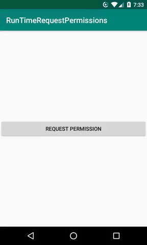
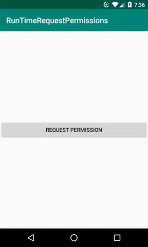

# Runtime Request Permissions

This project is an example of how to handle multiple permissions at runtime, informing the user through a Dialog Alert the need for permission.

In addition to the above, if the user clicks "don't ask again" it is still possible to handle the permission.

## Getting Started
#### Using Git Bash
```
git clone git@github.com:MurilloComino/android-runtime-request-permissions.git
```

#### Using Android Studio
```
in File > New > Project from Version Control... > git

in URL put: https://github.com/MurilloComino/android-runtime-request-permissions.git

and then clone
```

## Installing
* Connect via usb your android phone.
* After cloning the project, open the terminal and navigate to the root folder.

#### Windows
````
gradlew installDebug
````
#### Linux & MacOS
````
./gradlew installDebug
````

## Example




## Built With

* [Android Studio 3.5](https://developer.android.com/studio) - The IDE used - API > 22

## License

* [Apache License 2.0](https://github.com/MurilloComino/android-runtime-request-permissions/blob/master/LICENSE.md)